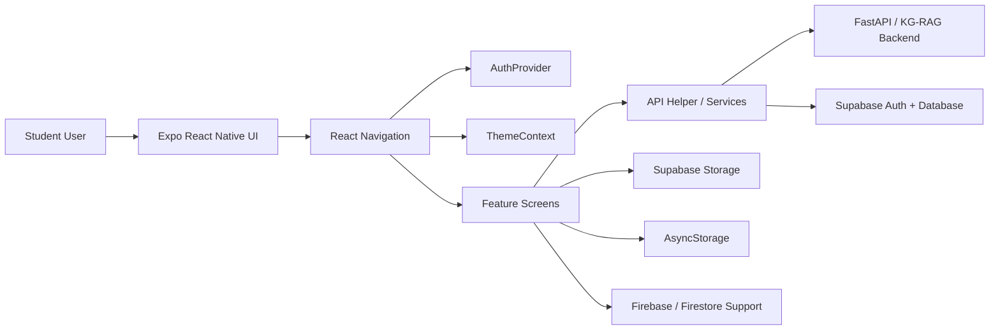

# KTUfy Project Overview for PPT

## Abstract
KTUfy is an AI-powered academic assistant designed for KTU students. It combines a knowledge graph-augmented retrieval-augmented generation (KG-RAG) chatbot with study management, learning tools, media utilities, and academic support features in a cross-platform Expo React Native application.

The system is built to reduce the effort required for exam preparation, syllabus navigation, checklist management, and academic decision-making by providing one integrated student productivity platform.

## Introduction
Students often need to switch between separate tools for studying, planning, coding practice, question papers, and AI help. KTUfy addresses this fragmentation by bringing the most important academic workflows into one mobile-first application.

The app is built with React Native and Expo, supports iOS, Android, and Web, and uses Supabase for authentication and backend data services. It also includes AI-powered and gamified learning features to improve engagement and consistency.

## Objective
The main objectives of KTUfy are:
- To provide a unified academic assistant for KTU students.
- To offer AI-based question answering with syllabus-aware context.
- To help students manage checklists, schedules, notes, and study materials.
- To support interactive learning through quizzes, flashcards, and games.
- To make the app accessible on mobile and web with a consistent UI.

## Problem Statement
Students face several common academic problems:
- Study resources are scattered across multiple apps and websites.
- It is difficult to track syllabus progress and pending topics.
- Existing tools are not tailored to KTU-specific academic needs.
- Students need fast support for doubt clearing, coding practice, and GPA calculation.
- Motivation drops when learning tools are not interactive or personalized.

KTUfy solves these issues by combining AI assistance, academic utilities, and gamified learning in one system.

## Existing System
The traditional approach to student productivity relies on separate tools for each task:
- Notes and syllabus are maintained manually or in disconnected apps.
- Question papers and study materials are searched from different sources.
- Chatbots usually give generic responses without academic context.
- Gamified learning and academic planning are rarely combined.

Limitations of the existing system:
- No single integrated platform.
- Poor context awareness for KTU-specific queries.
- Limited personalization and progress tracking.
- Low engagement for repetitive study workflows.

## Proposed System
KTUfy proposes an integrated academic assistant with the following capabilities:
- AI chatbot for KTU-related academic support.
- Study checklist and syllabus-based topic tracking.
- Library, previous year papers, and schedule management.
- Coding Hub for programming practice.
- Learning Zone with games, quizzes, and flashcards.
- GPA calculator and other academic utilities.
- Media tools for file handling and processing.

The proposed system improves productivity by keeping all academic functions inside one application with authenticated user data, synchronized storage, and a consistent design system.

## System Design
### High-Level Architecture
1. Presentation Layer
- Built with Expo React Native screens.
- Handles login, dashboard, chatbot, learning tools, and utility screens.
- Uses React Navigation stack routing.

2. Application Layer
- Contains auth, theme, and feature-level state management.
- Uses reusable components and screen-specific logic.
- Handles screen transitions and user session flow.

3. Service Layer
- Centralized API helpers for backend communication.
- Feature services for chatbot, ticklists, syllabus, media processing, and other modules.
- Normalizes backend requests and responses.

4. Data Layer
- Supabase Auth for authentication.
- Supabase Postgres for structured application data.
- Supabase Storage for file-based content.
- AsyncStorage for local theme/session preferences.
- Firebase configuration remains available for learning/statistics related extensions.

### Suggested Architecture Diagram for PPT

## Implementation
### Frontend Stack
- React Native with Expo
- TypeScript
- React Navigation stack routing
- Expo Secure Storage / AsyncStorage
- Supabase JavaScript client
- Native and web-compatible file and media modules

### Core Files and Modules
- App bootstrap and navigation in `App.tsx`
- Authentication state in `auth/AuthProvider.tsx`
- Theming in `contexts/ThemeContext.tsx`
- API communication in `utils/api.ts`
- Supabase client configuration in `supabaseClient.ts`
- Feature-specific business logic in `services/`
- UI screens in `screens/`

### Major Screens and Modules
- Login, Signup, Home, Profile, Settings, and Help screens
- Chatbot, Ticklist, Library, Schedule, Learning Zone, and Syllabus Viewer
- Coding Hub, GPA Calculator, PYP, Explore, Flashcards, Match Game, and Quiz Game
- Media tools: Audio, Video, Image, and PDF utilities

## Methodology
The development approach follows a modular mobile app workflow:
1. User authentication and session restoration.
2. Route selection based on auth state.
3. Feature-driven screen rendering.
4. Backend API calls through a centralized request helper.
5. Secure data storage and persistence.
6. Continuous refinement of UI and feature modules.

The AI workflow is designed so the frontend sends authenticated prompts to the backend, which can perform retrieval, context enrichment, and response generation using academic knowledge sources.

## Result
KTUfy delivers a single platform for KTU students to:
- Ask academic questions through an AI assistant.
- Track study progress and checklists.
- Access syllabus and study materials.
- Practice coding and gamified learning tasks.
- Calculate GPA and manage schedules.
- Process media files through built-in tools.

The result is a more organized, interactive, and context-aware academic experience.

## Output
The application output includes:
- A responsive login and signup flow.
- A personalized authenticated academic dashboard.
- AI-generated chatbot answers with session support.
- Study management tools for syllabus, ticklists, and library content.
- Interactive learning games and quizzes.
- Utility tools for media and document workflows.

For a PPT demonstration, the output can be shown as live screen flows, feature screenshots, or a short demo of the chatbot and learning tools.

## Conclusion
KTUfy demonstrates how AI, academic utilities, and gamified learning can be combined into one student-centric platform. Its modular architecture makes it easy to extend, while Supabase-backed authentication and storage provide a secure and scalable foundation.

By focusing on KTU-specific academic needs, the system improves accessibility, productivity, and engagement for students.

## References
- Expo React Native documentation
- React Navigation documentation
- Supabase documentation
- FastAPI documentation
- Firebase documentation
- KTU syllabus and academic references used by the project
- Project files: `README.md`, `APP_FEATURES_AND_TECH_STACK.md`, `BACKEND_SPEC.md`, `LEARNING_ZONE_FEATURES.md`

## Short PPT Slide Outline
If you want this in presentation format, use these slide titles:
1. Abstract
2. Introduction
3. Objective
4. Problem Statement
5. Existing System
6. Proposed System
7. System Design
8. Implementation
9. Methodology
10. Result
11. Output
12. Conclusion
13. References

## Feature Summary
### Academic Features
- AI chatbot assistant
- Ticklist and syllabus tracking
- Library and question paper support
- Schedule management
- GPA calculator
- Profile and settings management

### Learning Features
- Memory match game
- Quick quiz
- Flashcards
- Coding practice hub
- Subject browsing and exploration

### Utility Features
- Audio tools
- Video tools
- Image tools
- PDF tools
- Media processing and sharing

### Platform and Architecture Features
- Cross-platform support for iOS, Android, and Web
- Role of theme and auth context providers
- Centralized API request layer
- Supabase-based authentication and data access
- Modular screen-based architecture
