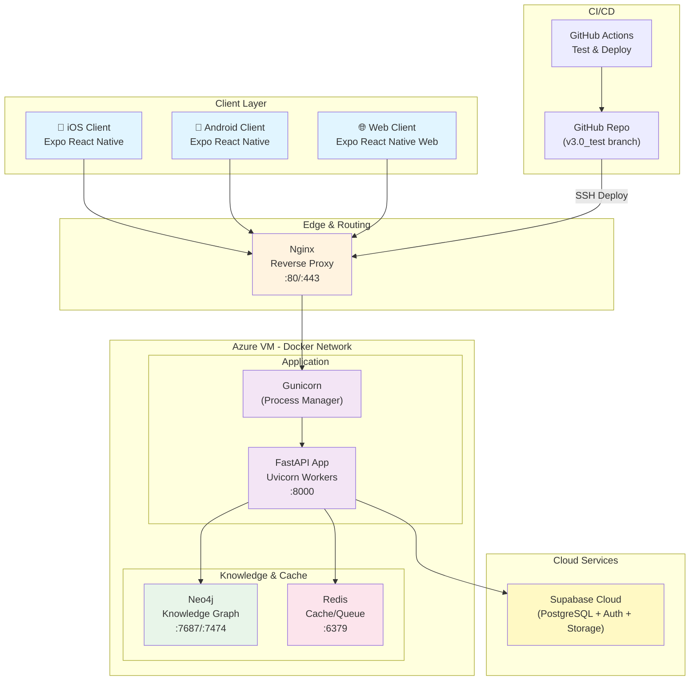
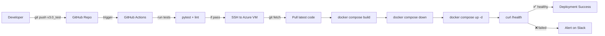

# KTUfy Proposed System Architecture

**Version:** 1.0  
**Date:** May 5, 2026  
**Status:** Production-Ready Design

---

## Executive Summary

KTUfy is a containerized, cloud-native academic platform combining:
- **Frontend**: Cross-platform Expo React Native (iOS, Android, Web)
- **Backend**: FastAPI on Azure VM with Docker orchestration
- **Data**: Supabase (PostgreSQL, Auth, Storage) + Neo4j (Knowledge Graph) + Redis (Cache)
- **Deployment**: GitHub Actions CI/CD to Azure VM with Docker Compose

---

## System Architecture Overview



---

## Detailed Layer Architecture

### 1. Client Layer (Frontend)

#### Platform: Expo React Native

**Supported Targets:**
- iOS (native, via Expo)
- Android (native, via Expo)
- Web (browser, via Expo Web)

**Core Technologies:**
- React Native with TypeScript
- React Navigation (stack routing)
- Supabase JavaScript Client
- Secure token storage via Expo Secure Store / AsyncStorage

**Key Responsibilities:**
- User authentication flow
- Session management with JWT tokens
- Screen navigation and state management
- Real-time API communication with retry logic
- Theme management (light/dark mode)
- Local data caching

#### Authentication Flow

```
User Login Input
  ↓
Supabase Auth API (Email/Password)
  ↓
JWT Token issued + stored in Expo Secure Store
  ↓
API calls include: Authorization: Bearer <JWT>
  ↓
Nginx/FastAPI validates JWT via Supabase secret
  ↓
User identified and RLS policies applied in Supabase
```

#### Feature Screens Organization

| Category | Screens | Purpose |
|----------|---------|---------|
| Auth | Login, Signup, Password Reset | User onboarding |
| Dashboard | Home, Profile, Settings, Help | Core navigation hub |
| Study Tools | Ticklist, Library, Syllabus, PYP, Schedule | Academic management |
| AI & Learning | Chatbot, Learning Zone, Coding Hub | Interactive support |
| Utilities | GPA Calculator, Group Study, Media Tools | Productivity features |
| Media | Audio/Video/Image/PDF Tools | Content processing |

---

### 2. Edge Layer (Nginx)

**Role:** Public reverse proxy and TLS termination

**Port Mapping:**
- `80` (HTTP, redirects to 443 in production)
- `443` (HTTPS with valid SSL certificate)

**Responsibilities:**
- Accept client connections (HTTPS/TLS)
- Forward authenticated traffic to FastAPI backend on `localhost:8000`
- Handle large file uploads
- Rate limiting (optional)
- Request logging
- Health check proxying to `/health` endpoint

**Configuration Pattern:**
```nginx
upstream backend {
    server fastapi:8000;
}

server {
    listen 443 ssl;
    server_name api.ktufy.example.com;
    
    ssl_certificate /path/to/cert.pem;
    ssl_certificate_key /path/to/key.pem;
    
    location / {
        proxy_pass http://backend;
        proxy_set_header Authorization $http_authorization;
        proxy_set_header Host $host;
        proxy_set_header X-Real-IP $remote_addr;
    }
    
    location /health {
        proxy_pass http://backend;
        access_log off;
    }
}
```

---

### 3. Application Layer (Backend)

#### Technology Stack

- **Framework:** FastAPI (Python)
- **Process Manager:** Gunicorn
- **ASGI Server:** Uvicorn
- **Port:** `8000` (internal Docker network)
- **Database ORM:** SQLAlchemy
- **API Schema:** OpenAPI/Swagger

#### Core Services

```
FastAPI Application
├── Authentication Routes
│   ├── POST /api/v1/auth/signup
│   ├── POST /api/v1/auth/signin
│   ├── GET /api/v1/auth/me (Profile)
│   ├── PUT /api/v1/auth/me (Update profile)
│   └── POST /api/v1/auth/signout
│
├── Chat API (AI Chatbot)
│   ├── POST /api/v1/chat/message
│   ├── GET /api/v1/chat/sessions
│   ├── POST /api/v1/chat/sessions
│   ├── GET /api/v1/chat/sessions/{id}
│   ├── PUT /api/v1/chat/sessions/{id}
│   └── DELETE /api/v1/chat/sessions/{id}
│
├── Syllabus & Learning
│   ├── GET /api/v1/syllabus/subjects
│   ├── GET /api/v1/syllabus/{subject_code}
│   ├── POST /api/v1/ticklist/generate (AI checklist)
│   └── GET /api/v1/flashcards/{subject}
│
├── Coding Hub
│   ├── POST /api/v1/code/execute
│   ├── GET /api/v1/code/problems
│   └── POST /api/v1/code/submit
│
├── Media Processing
│   ├── POST /api/v1/media/audio-process
│   ├── POST /api/v1/media/video-process
│   ├── POST /api/v1/media/image-process
│   └── POST /api/v1/media/pdf-process
│
├── Admin & Monitoring
│   ├── GET /health
│   ├── GET /api/v1/admin/status
│   └── GET /metrics
│
└── Utilities
    ├── GET /api/v1/gpa/calculate
    ├── POST /api/v1/schedule/create
    └── GET /api/v1/schedule/{user_id}
```

#### Request Processing Pipeline

```
1. Nginx receives HTTPS request
2. Nginx forwards to FastAPI:8000
3. FastAPI middleware extracts JWT token from Authorization header
4. Supabase JWT validation (verify signature + expiry)
5. Extract user_id from JWT subject (sub)
6. Apply RLS policies (user can only access their own data)
7. Execute endpoint handler
8. Query Supabase DB, Neo4j, Redis as needed
9. Format response
10. Return to Nginx
11. Nginx returns HTTPS response to client
```

#### AI/KG-RAG Pipeline

```
User Query (Chat Message)
  ↓
FastAPI /api/v1/chat/message endpoint
  ↓
Extract user context from Supabase (profile, completed courses, etc.)
  ↓
Query Neo4j Knowledge Graph for relevant academic concepts
  ↓
Retrieve embedding vectors from Vector Store (if applicable)
  ↓
Call LLM (e.g., OpenAI, Gemini) with:
    - System prompt (role: KTUfy academic assistant)
    - User query
    - Retrieved knowledge graph context
    - Relevant syllabus content
  ↓
Generate response
  ↓
Store message pair in Supabase chat_sessions table
  ↓
Return response + session_id to client
  ↓
Frontend displays response
```

---

### 4. Data & Service Layer

#### Supabase (Cloud Managed Service)

**Components:**
- PostgreSQL database
- Auth service (Email/Password + JWT)
- Storage service (file uploads)

**Key Tables:**

| Table | Purpose | Owner |
|-------|---------|-------|
| `auth.users` | User accounts | Supabase Auth |
| `public.users` | User profiles (mirrors auth.users) | Per-user RLS |
| `public.chat_sessions` | Chat conversation sessions | Per-user RLS |
| `public.chat_messages` | Individual chat messages | Per-user RLS |
| `public.ticklists` | Study checklists | Per-user RLS |
| `public.user_notes` | Study notes/bookmarks | Per-user RLS |
| `public.study_dashboard` | Streak, study time, stats | Per-user RLS |
| `public.exam_schedule` | Academic calendar | Public read, admin write |
| `public.syllabus_content` | KTU syllabus data | Public read, admin write |
| `public.coding_problems` | Coding practice problems | Public read, admin write |
| `public.game_stats` | Learning zone scores | Per-user RLS |

**RLS Policy Example:**
```sql
CREATE POLICY "Users can only access own data"
ON public.users
FOR ALL
USING (auth.uid() = id);
```

**Storage Buckets:**
- `study-materials/` - PDFs, documents
- `media-uploads/` - Audio, video, images
- `profile-pics/` - User avatars

#### Neo4j (Knowledge Graph)

**Purpose:** Store and query academic knowledge relationships

**Schema:**

```
Node Types:
  - Subject (CST 201, CST 202, etc.)
  - Module (Module 1, Module 2, etc.)
  - Topic (Data Structures, Algorithms, etc.)
  - Concept (Tree, Graph, Sorting, etc.)
  - Course (B.Tech CSE, B.Tech ECE, etc.)

Relationships:
  - Subject -[CONTAINS]-> Module
  - Module -[COVERS]-> Topic
  - Topic -[INCLUDES]-> Concept
  - Concept -[RELATED_TO]-> Concept
  - Course -[HAS]-> Subject
  - Concept -[DIFFICULTY: easy|medium|hard]-> Concept
```

**Query Examples:**
- Find all topics in CST 201 Module 2
- Find related concepts for a given topic
- Retrieve prerequisite topics for a course
- Build study paths through the knowledge graph

#### Redis (Cache & Queue)

**Use Cases:**
- Cache frequently requested syllabus content
- Store temporary JWT token blacklists
- Queue for async media processing jobs
- Session cache for chat rate limiting

**Expiry Policies:**
- Syllabus cache: 24 hours
- Token blacklist: until expiry time
- Media jobs: until completion or 1 hour timeout

---

### 5. Deployment Layer (Azure VM + Docker)

#### Docker Compose Services

```yaml
version: '3.8'

services:
  nginx:
    image: nginx:latest
    ports:
      - "80:80"
      - "443:443"
    volumes:
      - ./nginx.conf:/etc/nginx/nginx.conf:ro
      - ./ssl:/etc/nginx/ssl:ro
    depends_on:
      - backend
    networks:
      - ktufy

  backend:
    build: ./backend
    image: ktufy-backend:latest
    container_name: ktufy-backend
    ports:
      - "8000:8000"
    environment:
      - DATABASE_URL=postgresql://user:pass@db:5432/ktufy
      - SUPABASE_URL=${SUPABASE_URL}
      - SUPABASE_KEY=${SUPABASE_KEY}
      - NEO4J_URI=bolt://neo4j:7687
      - NEO4J_USER=${NEO4J_USER}
      - NEO4J_PASSWORD=${NEO4J_PASSWORD}
      - REDIS_URL=redis://redis:6379
      - JWT_SECRET=${JWT_SECRET}
    depends_on:
      - neo4j
      - redis
    networks:
      - ktufy
    healthcheck:
      test: ["CMD", "curl", "-f", "http://localhost:8000/health"]
      interval: 10s
      timeout: 5s
      retries: 3

  neo4j:
    image: neo4j:latest
    container_name: ktufy-neo4j
    ports:
      - "7474:7474"
      - "7687:7687"
    environment:
      - NEO4J_AUTH=neo4j/${NEO4J_PASSWORD}
      - NEO4J_PLUGINS=["apoc"]
    volumes:
      - neo4j-data:/data
    networks:
      - ktufy

  redis:
    image: redis:7-alpine
    container_name: ktufy-redis
    ports:
      - "6379:6379"
    volumes:
      - redis-data:/data
    networks:
      - ktufy

  worker:
    build: ./backend
    image: ktufy-backend:latest
    container_name: ktufy-worker
    command: celery -A app.celery_app worker --loglevel=info
    environment:
      - SUPABASE_URL=${SUPABASE_URL}
      - SUPABASE_KEY=${SUPABASE_KEY}
      - NEO4J_URI=bolt://neo4j:7687
      - REDIS_URL=redis://redis:6379
    depends_on:
      - redis
      - neo4j
    networks:
      - ktufy

volumes:
  neo4j-data:
  redis-data:

networks:
  ktufy:
    driver: bridge
```

#### CI/CD Deployment Flow



#### Environment Variables (.env on Azure VM)

```bash
# Supabase
SUPABASE_URL=https://your-project.supabase.co
SUPABASE_KEY=your-anon-key
SUPABASE_JWT_SECRET=your-jwt-secret

# Neo4j
NEO4J_USER=neo4j
NEO4J_PASSWORD=<strong-password>

# API Keys
JWT_SECRET=<your-secret>
API_KEY=<api-key>

# LLM Services
OPENAI_API_KEY=sk-...
GEMINI_API_KEY=...

# Firebase (optional)
FIREBASE_PROJECT_ID=ktufy-8428e

# Redis
REDIS_URL=redis://redis:6379

# Azure
AZURE_STORAGE_ACCOUNT=...
AZURE_STORAGE_KEY=...
```

---

### 6. Data Flow - Complete Request Journey

#### Example: User sends chat message

```
┌─────────────────────────────────────────────────────────────┐
│ 1. FRONTEND (Expo React Native)                             │
│    - User types question in Chatbot screen                  │
│    - Calls: sendChatMessage(message, sessionId)             │
│    - Service layer: chatService.ts                          │
└─────────────────────────────────────────────────────────────┘
                            ↓
┌─────────────────────────────────────────────────────────────┐
│ 2. API HELPER (utils/api.ts)                                │
│    - Retrieves JWT from Supabase session                    │
│    - Constructs: POST /api/v1/chat/message                  │
│    - Headers: Authorization: Bearer <JWT>                   │
│    - Body: {message, session_id, system_prompt}            │
└─────────────────────────────────────────────────────────────┘
                            ↓
┌─────────────────────────────────────────────────────────────┐
│ 3. NGINX (Reverse Proxy)                                    │
│    - Receives HTTPS request on port 443                     │
│    - Forwards to http://fastapi:8000                        │
│    - Maintains Authorization header                         │
└─────────────────────────────────────────────────────────────┘
                            ↓
┌─────────────────────────────────────────────────────────────┐
│ 4. FASTAPI (Application Layer)                              │
│    - Middleware: Extract JWT token                          │
│    - Validate JWT signature using SUPABASE_JWT_SECRET       │
│    - Extract user_id from JWT payload (sub field)           │
│    - Route to: POST /api/v1/chat/message handler            │
└─────────────────────────────────────────────────────────────┘
                            ↓
┌─────────────────────────────────────────────────────────────┐
│ 5. BUSINESS LOGIC (Chat Handler)                            │
│    - Get user profile from Supabase                         │
│    - Retrieve or create chat session (if new)               │
│    - Store user message in Supabase (chat_messages table)   │
└─────────────────────────────────────────────────────────────┘
                            ↓
┌─────────────────────────────────────────────────────────────┐
│ 6. KNOWLEDGE GRAPH LAYER                                    │
│    - Query Neo4j for relevant topics/concepts               │
│    - Use user's course/semester context                     │
│    - Build context string from KG results                   │
│    - Query vector store if applicable                       │
└─────────────────────────────────────────────────────────────┘
                            ↓
┌─────────────────────────────────────────────────────────────┐
│ 7. LLM CALL (AI Generation)                                 │
│    - System prompt: "You are a KTU academic assistant"      │
│    - User query + KG context                                │
│    - Call OpenAI/Gemini API                                 │
│    - Stream or wait for full response                       │
└─────────────────────────────────────────────────────────────┘
                            ↓
┌─────────────────────────────────────────────────────────────┐
│ 8. RESPONSE STORAGE                                         │
│    - Store AI response in Supabase (chat_messages)          │
│    - Update chat_sessions (updated_at timestamp)            │
│    - Return to FastAPI handler                              │
└─────────────────────────────────────────────────────────────┘
                            ↓
┌─────────────────────────────────────────────────────────────┐
│ 9. API RESPONSE                                             │
│    - JSON: {message, assistant_message, session_id}         │
│    - Status: 200 OK                                         │
│    - Return through Nginx to client                         │
└─────────────────────────────────────────────────────────────┘
                            ↓
┌─────────────────────────────────────────────────────────────┐
│ 10. FRONTEND (React Native)                                 │
│     - Receive response in chatService                       │
│     - Update ChatbotScreen state                            │
│     - Display AI response in chat UI                        │
│     - Store session_id for future messages                  │
└─────────────────────────────────────────────────────────────┘
```

---

## Security Architecture

### Authentication & Authorization

```
┌─────────────────────────────────────────────┐
│ User provides email + password              │
└──────────────┬──────────────────────────────┘
               ↓
┌──────────────────────────────────────────────┐
│ Supabase Auth validates and issues JWT      │
│ JWT includes: {sub: user_id, exp, iat}     │
└──────────────┬───────────────────────────────┘
               ↓
┌──────────────────────────────────────────────┐
│ Frontend stores JWT in Expo Secure Store    │
│ (platform-native secure storage)            │
└──────────────┬───────────────────────────────┘
               ↓
┌──────────────────────────────────────────────┐
│ Each API request includes:                  │
│ Authorization: Bearer <JWT>                 │
└──────────────┬───────────────────────────────┘
               ↓
┌──────────────────────────────────────────────┐
│ FastAPI middleware validates JWT:           │
│ - Verify signature (using JWT_SECRET)       │
│ - Check expiration                          │
│ - Extract user_id from 'sub'                │
└──────────────┬───────────────────────────────┘
               ↓
┌──────────────────────────────────────────────┐
│ Supabase RLS policies enforce access:       │
│ - Users can only access own data            │
│ - Admin users can access all data           │
└─────────────────────────────────────────────┘
```

### Data Protection

- **In Transit:** HTTPS/TLS (via Nginx + SSL certificate)
- **At Rest:** Supabase encryption (PostgreSQL)
- **Secrets:** Environment variables in Azure Key Vault
- **API Keys:** Stored server-side, never exposed to frontend

---

## Scalability Considerations

### Current Topology
- Single Azure VM hosts all services
- Suitable for up to ~5,000 concurrent users
- Vertical scaling available through VM resize

### Future Scaling Paths

1. **Horizontal Scaling (Recommended for 5K-50K users)**
   - Load balancer (Azure Load Balancer)
   - Multiple backend instances behind load balancer
   - Shared Redis for session cache
   - Supabase handles database scaling automatically

2. **Containerized Orchestration (K8s)**
   - Move from Docker Compose to Azure Container Instances (ACI) or AKS
   - Auto-scaling based on CPU/memory
   - Multi-region failover

3. **Async Processing**
   - Use Redis + Celery for background jobs
   - Separate worker container for media processing
   - Job queuing and retry logic

---

## Monitoring & Health Checks

### Health Endpoint Response

```json
{
  "status": "healthy",
  "timestamp": "2026-05-05T10:30:00Z",
  "checks": {
    "fastapi": "healthy",
    "supabase": "healthy",
    "neo4j": "healthy",
    "redis": "healthy"
  },
  "version": "1.0.0"
}
```

### Key Metrics to Monitor

- Request latency (p50, p95, p99)
- Error rate (4xx, 5xx)
- Container CPU & memory usage
- Neo4j query performance
- Redis hit rate
- Supabase connection pool utilization

---

## Deployment Checklist

- [ ] SSL certificate obtained and installed on Azure VM
- [ ] Environment variables configured in `.env` file
- [ ] Docker images built and tested locally
- [ ] GitHub Actions workflow configured
- [ ] SSH keys configured for GitHub Actions → Azure VM
- [ ] Initial database schema applied (Supabase migrations)
- [ ] Neo4j knowledge graph seeded with academic data
- [ ] Health endpoint verified responding 200
- [ ] Frontend API base URL configured to point to Nginx
- [ ] Load testing performed
- [ ] Backup strategy for Neo4j and Redis volumes established
- [ ] Monitoring dashboards set up
- [ ] Documentation updated for operations team

---

## Summary

The KTUfy Proposed System Architecture is a production-ready, containerized deployment combining:

- **Frontend:** Cross-platform Expo React Native with Supabase Auth
- **Backend:** FastAPI with Neo4j KG, Redis cache, containerized on Azure VM
- **Data:** Supabase cloud (managed PostgreSQL + Auth + Storage)
- **Deployment:** Automated CI/CD via GitHub Actions

The architecture is scalable, secure, and maintainable, with clear separation of concerns across presentation, application, data, and deployment layers.
